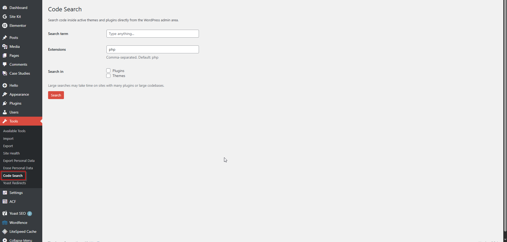
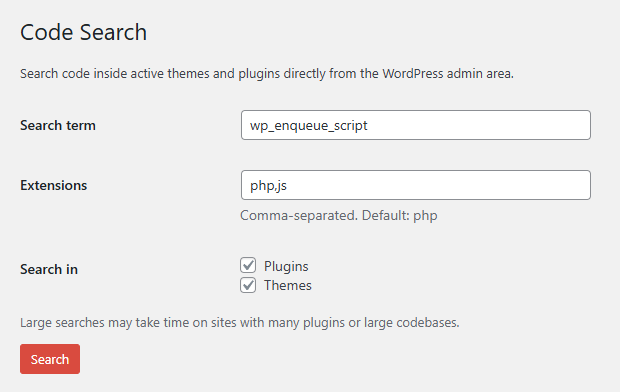
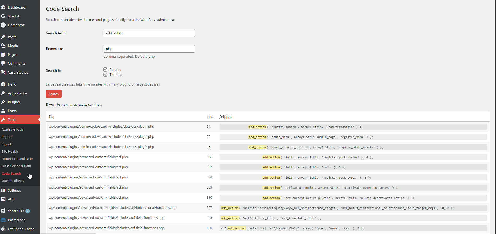
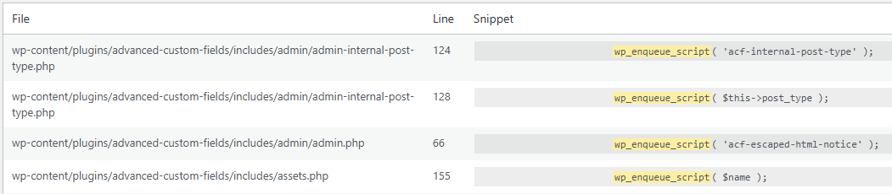

[Admin Code Search Banner](assets/github-banner.png)
# Admin Code Search

Search code inside active themes and plugins directly from the WordPress admin area.

---

## Description

Admin Code Search is a lightweight developer utility that lets you search code inside active themes and plugins without leaving the WordPress admin.

Built for developers who need quick insight into a codebase — whether you're tracking down a function, hook, class, or string — without opening an IDE or connecting via FTP.

---

## Features

- Admin-only access
- Search across active plugins
- Search active theme (including parent theme)
- Support for custom file extensions (e.g. php, js, css, inc)
- Line-by-line results
- Highlighted matches
- Clean, readable results table

---

## Installation

1. Upload the plugin folder to `/wp-content/plugins/`
2. Activate the plugin through the WordPress admin
3. Go to **Tools → Code Search**
4. Enter a search term and run a search

---

## Usage

Enter any keyword, function name, hook, or string and scan your active theme and plugins.

You can optionally define which file types to include in the search.

---

## FAQ

**Who can use this plugin?**  
Only administrators or users with the `manage_options` capability.

**What files are searched?**  
Files in active plugins, the active theme, and the parent theme (if used).  
Inactive plugins and themes are not included.

**Can I search file types other than PHP?**  
Yes. You can define custom file extensions (for example: php, js, css, inc).

**Does this affect site performance?**  
Search runs only when triggered manually in the admin.  
It does not run in the background or affect frontend performance.

**Does this plugin modify any files?**  
No. The plugin is read-only.

**Is any data sent outside my site?**  
No. All searches are performed locally on your server.

---

## Privacy

This plugin does not send any data to external services.

---

## Screenshots

### 1. Admin Code Search interface in Tools → Code Search

### 2. Search input with custom file extensions

### 3. Results showing matches across plugin and theme files

### 4. Detailed result with file path, line number, and highlighted match

---

## Changelog

### 1.1.0
- Added case-sensitive search option
- Added result count summary
- Improved scanner handling for readable files
- Internal refactoring and codebase cleanup

### 1.0.0
- Initial public release.

---

## License

GPLv2 or later  
https://www.gnu.org/licenses/gpl-2.0.html
